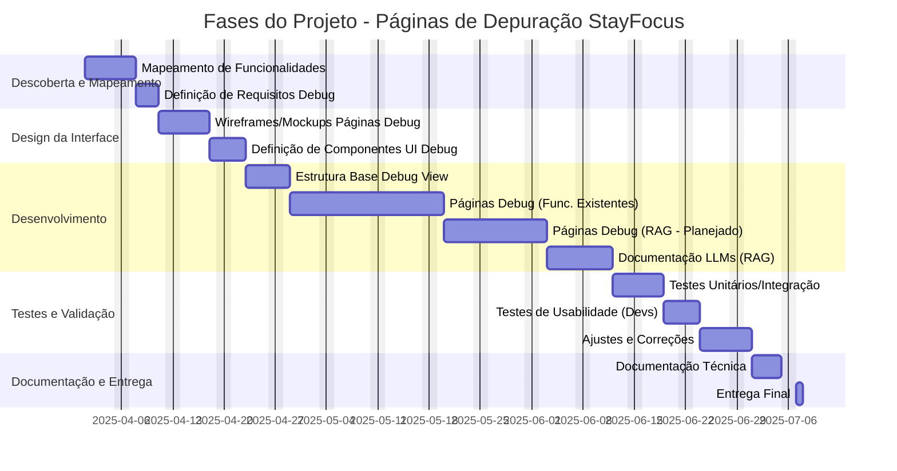

# Plano de Projeto: Páginas de Depuração para Painel Administrativo StayFocus

**Introdução:**

Este plano detalha as etapas e especificações para a criação de um conjunto abrangente de páginas de depuração (debug) para o painel administrativo do aplicativo StayFocus. O objetivo é fornecer aos desenvolvedores ferramentas visuais e interativas para inspecionar o estado interno, monitorar fluxos de dados, simular cenários e diagnosticar problemas em todas as funcionalidades existentes e planejadas (como RAG), facilitando a manutenção, o desenvolvimento e a garantia de qualidade da aplicação.

**1. Fases do Projeto:**

O projeto será dividido nas seguintes fases:

*   **Fase 1: Descoberta e Mapeamento de Funcionalidades (8 dias úteis):**
    *   Análise detalhada do `repomix-output.xml` e do código fonte para identificar todas as funcionalidades, componentes e fluxos de dados relevantes.
    *   Definição dos requisitos específicos de depuração para cada funcionalidade.
*   **Fase 2: Design da Interface de Debug (8 dias úteis):**
    *   Criação de wireframes e mockups para as páginas de depuração, focando na clareza e usabilidade para desenvolvedores.
    *   Definição de componentes de UI reutilizáveis específicos para a interface de debug (visualizadores de estado, logs, controles de simulação).
*   **Fase 3: Desenvolvimento (36 dias úteis):**
    *   Implementação da estrutura base para as páginas de depuração (roteamento, layout).
    *   Desenvolvimento das páginas de debug para as funcionalidades existentes, agrupadas por módulo (Alimentação, Estudos, Saúde, etc.).
    *   Desenvolvimento das páginas de debug específicas para a funcionalidade RAG planejada.
    *   Criação do documento técnico comparativo de LLMs para RAG.
*   **Fase 4: Testes e Validação (13 dias úteis):**
    *   Implementação de testes unitários e de integração para os componentes de debug.
    *   Realização de testes de usabilidade com a equipe de desenvolvimento para garantir a eficácia das ferramentas.
    *   Correção de bugs e ajustes com base no feedback.
*   **Fase 5: Documentação e Entrega (5 dias úteis):**
    *   Criação da documentação técnica explicando como usar as páginas de depuração.
    *   Preparação e entrega final do módulo de depuração.

**2. Mapeamento de Funcionalidades:**

*   **Metodologia:**
    1.  **Análise Estrutural (`repomix-output.xml`):** Utilizar a `<directory_structure>` para identificar os principais módulos (`app/alimentacao`, `app/estudos`, `app/saude`, etc.) e subfuncionalidades (componentes dentro de cada módulo).
    2.  **Análise de Stores (Zustand):** Mapear os arquivos em `app/stores/` (`alimentacaoStore.ts`, `financasStore.ts`, etc.) para entender o estado gerenciado por cada funcionalidade e as ações disponíveis. Isso será crucial para definir o que exibir e controlar nas páginas de debug.
    3.  **Análise de Rotas (`app/[seção]/page.tsx`):** Identificar as páginas principais de cada seção e os componentes que elas renderizam.
    4.  **Análise de Componentes (`app/components/`):** Listar os componentes reutilizáveis e específicos de cada seção para entender a granularidade da depuração necessária.
    5.  **Análise de API (`pages/api/`):** Identificar os endpoints de API utilizados (ex: autenticação Google Drive) para incluir logs de requisição/resposta no debug.
    6.  **Análise de Tipos (`app/types/`):** Compreender as estruturas de dados utilizadas para formatar a exibição do estado.
*   **Lista Inicial de Funcionalidades Mapeadas (Exemplos):**
    *   **Início:** Painel do Dia, Lista de Prioridades, Lembrete de Pausas, Checklist de Medicamentos.
    *   **Alimentação:** Planejador de Refeições, Registro de Refeições, Lembrete de Hidratação.
    *   **Estudos:** Temporizador Pomodoro, Registro de Estudos, Conferência de Simulados (Loader, Review, Results), Histórico de Simulados.
    *   **Saúde:** Registro de Medicamentos, Monitoramento de Humor (Calendário, Fatores).
    *   **Lazer:** Temporizador de Lazer, Atividades de Lazer, Sugestões de Descanso.
    *   **Finanças:** Rastreador de Gastos, Envelopes Virtuais, Calendário de Pagamentos, Adicionar Despesa.
    *   **Hiperfocos:** Conversor de Interesses, Sistema de Alternância, Visualizador de Projetos, Temporizador de Foco.
    *   **Sono:** Registro de Sono, Visualizador Semanal, Configuração de Lembretes.
    *   **Autoconhecimento:** Editor/Lista de Notas, Modo Refúgio.
    *   **Perfil:** Informações Pessoais, Metas Diárias, Preferências Visuais.
    *   **Autenticação/Drive:** Conexão, Desconexão, Listar, Salvar, Carregar.
    *   **RAG (Planejado):** Chat, Processo de Retrieval, Geração de Resposta.

**3. Especificações das Páginas de Debug (Funcionalidades Existentes):**

Será criada uma seção `/debug` no aplicativo, acessível apenas em ambiente de desenvolvimento, com sub-rotas para cada funcionalidade principal.

*   **Geral (Para a maioria das funcionalidades baseadas em Zustand):**
    *   **Informações:**
        *   Visualização em tempo real do estado completo da store Zustand correspondente (ex: `useAlimentacaoStore`).
        *   Histórico de ações despachadas na store (com payloads).
        *   Props recebidas pelos componentes principais da funcionalidade.
        *   Logs de eventos específicos da funcionalidade (ex: "Refeição adicionada", "Pomodoro iniciado").
    *   **Controles:**
        *   Capacidade de disparar ações da store manualmente com payloads customizados.
        *   Capacidade de modificar diretamente o estado da store (com aviso de risco).
        *   Botão para resetar o estado da store para o inicial.
*   **Exemplo (Alimentação - `debug/alimentacao`):**
    *   **Informações:** Estado de `useAlimentacaoStore` (refeicoes, registros, coposBebidos, metaDiaria), logs de adição/remoção de refeições/registros/copos.
    *   **Controles:** Disparar `adicionarRefeicao`, `removerRegistro`, `adicionarCopo`, modificar `metaDiaria`.
*   **Exemplo (Estudos/Simulados - `debug/estudos`):**
    *   **Informações:** Estado de `useSimuladoStore` (simuladoData, userAnswers, status), estado de `useHistoricoSimuladosStore`, logs de carregamento, seleção de resposta, finalização.
    *   **Controles:** Carregar JSON de simulado manualmente (via texto), resetar simulado, avançar/retroceder questão, limpar histórico.
*   **Exemplo (Autenticação/Drive - `debug/drive`):**
    *   **Informações:** Estado da sessão (presença de tokens, expiração), logs de chamadas API (`/api/drive/*`), respostas de erro da API Google.
    *   **Controles:** Botões para simular chamadas API (conectar, salvar, listar, carregar) com parâmetros customizados, botão para limpar sessão/tokens.

**4. Especificações das Páginas de Debug (Funcionalidade RAG - Planejada):**

Uma página dedicada (`/debug/rag`) será criada para inspecionar o pipeline RAG.

*   **Visualização do Retrieval:**
    *   Exibição da query original do usuário e da query expandida (se aplicável).
    *   Lista de chunks/documentos recuperados pelo retriever.
    *   Para cada chunk: ID, conteúdo, fonte (nome do arquivo/documento), score inicial de relevância.
    *   Visualização dos resultados do reranker (se aplicável), com novos scores.
*   **Inspeção do Prompt Final:**
    *   Exibição do prompt completo enviado ao LLM, destacando o contexto recuperado injetado.
    *   Informações sobre o template de prompt utilizado.
*   **Rastreamento do Fluxo de Execução:**
    *   Visualização em etapas do pipeline RAG (ex: `Query Input -> Query Expansion -> Retrieval -> Reranking -> Prompt Engineering -> LLM Call -> Post-processing -> Final Answer`).
    *   Tempo de execução (ms) para cada etapa principal.
    *   Possibilidade de "pausar" e "avançar" passo-a-passo em uma execução simulada.
*   **Logs e Métricas Específicas:**
    *   Logs detalhados de cada etapa, incluindo erros internos.
    *   Métricas intermediárias: número de chunks recuperados, score médio, tokens no prompt final, tokens na resposta do LLM.
*   **Testes Isolados:**
    *   Interface para testar o componente Retriever isoladamente: inserir uma query e ver os chunks recuperados.
    *   Interface para testar o componente Gerador (LLM Call) isoladamente: fornecer um prompt e ver a resposta gerada.
    *   Capacidade de usar diferentes LLMs configurados (ver seção 5) para testes comparativos rápidos.

**5. Documentação Comparativa de LLMs para RAG (Planejada):**

Será criado um documento técnico (provavelmente em Markdown, ex: `docs/llm-comparison-rag.md`) contendo:

*   **Critérios de Avaliação:**
    *   **Performance:** Qualidade da resposta (relevância, factualidade, coerência, ausência de alucinações), latência E2E, tempo de inferência isolado.
    *   **Custo:** Custo por token (input/output), custo de infraestrutura (se self-hosted), modelos de precificação.
    *   **Capacidades:** Tamanho da janela de contexto, capacidade de seguir instruções complexas, suporte a fine-tuning, multilinguismo (se necessário).
    *   **Operacional:** Facilidade de integração (API, bibliotecas), disponibilidade/SLA, licença de uso (open-source vs proprietário), documentação e suporte da comunidade/provedor.
*   **LLMs Selecionados para Avaliação (Lista Inicial Sugerida):**
    *   **Proprietários:** OpenAI GPT-4/GPT-4o, Anthropic Claude 3 (Haiku, Sonnet, Opus), Google Gemini (Pro/Flash).
    *   **Open-Source:** Meta Llama 3 (8B, 70B), Mistral AI Mixtral/Mistral Large (se acessível), outros modelos relevantes (ex: Cohere Command R+).
*   **Metodologia de Benchmarking:**
    *   **Dataset de Teste:** Criação de um conjunto representativo de perguntas/respostas esperadas baseado no domínio de conhecimento do StayFocus.
    *   **Métricas de Qualidade:**
        *   Automáticas: ROUGE, BLEU, METEOR (para similaridade com respostas de referência).
        *   Avaliação Humana: Framework para avaliação qualificada por especialistas no domínio, com critérios claros (ex: relevância, factualidade, utilidade, segurança).
    *   **Medição de Latência:** Scripts para medir o tempo de inferência do LLM isoladamente e a latência E2E do pipeline RAG completo para cada LLM.
    *   **Análise de Fluxo:** Uso das próprias páginas de debug RAG (etapa 4) para identificar gargalos ao trocar o LLM.
*   **Apresentação dos Resultados:**
    *   Tabelas comparativas com scores para cada critério e LLM.
    *   Gráficos de performance (Latência vs Qualidade, Custo vs Qualidade).
    *   Recomendações finais baseadas nos critérios e resultados, sugerindo 1-2 LLMs mais adequados para o backend RAG do StayFocus.

**6. Entregáveis, Cronograma e Responsabilidades:**

| Fase                         | Entregáveis Principais                                                                 | Cronograma Estimado | Responsável Sugerido |
| :--------------------------- | :------------------------------------------------------------------------------------- | :------------------ | :------------------- |
| 1. Descoberta e Mapeamento | Documento de Mapeamento de Funcionalidades, Lista de Requisitos de Debug             | 8 dias úteis        | Líder Técnico        |
| 2. Design da Interface       | Wireframes/Mockups das Páginas de Debug, Biblioteca de Componentes UI Debug          | 8 dias úteis        | Designer UX/UI       |
| 3. Desenvolvimento           | Estrutura de Roteamento Debug, Páginas de Debug Implementadas, Documento Comparativo LLMs | 36 dias úteis       | Desenvolvedor(es)    |
| 4. Testes e Validação        | Relatório de Testes, Relatório de Feedback de Usabilidade, Código Corrigido/Ajustado   | 13 dias úteis       | Desenvolvedor(es), QA |
| 5. Documentação e Entrega  | Documentação Técnica do Módulo de Debug, Código Finalizado e Integrado               | 5 dias úteis        | Líder Técnico        |
| **Total Estimado**           |                                                                                        | **70 dias úteis**   |                      |

*Nota: O cronograma é uma estimativa e pode variar dependendo da complexidade encontrada e dos recursos disponíveis.*