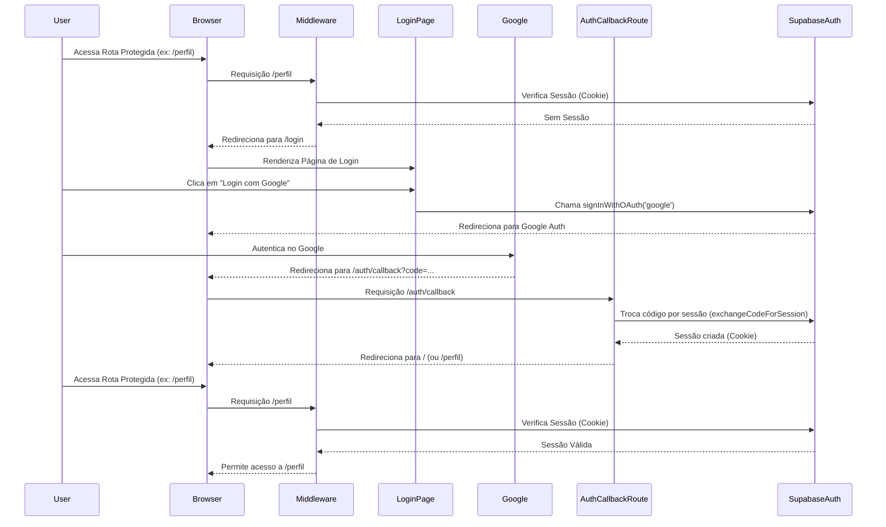

# Plano de Refatoração da Autenticação para Supabase Auth

## Objetivo

Unificar o sistema de autenticação da aplicação para utilizar exclusivamente o Supabase Auth, removendo o fluxo atual baseado em Google OAuth direto + Iron Session. Implementar proteção de rotas robusta utilizando middleware do Next.js com os helpers do Supabase Auth.

## Passos Detalhados

1.  **Instalar Dependências:**
    *   Adicionar `@supabase/auth-helpers-nextjs` ao `package.json` (via `npm install @supabase/auth-helpers-nextjs`).

2.  **Configurar Clientes Supabase (Auth Helpers):**
    *   Criar `app/lib/supabase/server.ts`: Exportar cliente para Server Components/Route Handlers (`createServerComponentClient` / `createRouteHandlerClient`).
    *   Criar `app/lib/supabase/client.ts`: Exportar cliente para Client Components (`createClientComponentClient`).
    *   Criar `app/lib/supabase/middleware.ts`: Exportar cliente para Middleware (`createMiddlewareClient`).
    *   Revisar/remover `app/lib/supabaseClient.ts` se os novos clientes o substituírem completamente.

3.  **Criar Middleware (`middleware.ts`):**
    *   Criar `middleware.ts` na raiz do projeto.
    *   Importar e usar `createMiddlewareClient` para obter a sessão Supabase a partir dos cookies.
    *   Definir rotas públicas (ex: `/`, `/login`, `/auth/callback`).
    *   Configurar o `matcher` para aplicar o middleware às rotas protegidas.
    *   Redirecionar usuários não autenticados para `/login` ao tentarem acessar rotas protegidas.
    *   Incluir lógica para atualizar a sessão (refresh) usando `supabase.auth.getSession()` dentro do middleware.

4.  **Criar Página de Login (`app/login/page.tsx`):**
    *   Criar como um Client Component.
    *   Importar o cliente Supabase para Client Components (`app/lib/supabase/client.ts`).
    *   Adicionar um botão "Login com Google".
    *   No `onClick` do botão, chamar `supabase.auth.signInWithOAuth({ provider: 'google', options: { redirectTo: \`${window.location.origin}/auth/callback\` } })`.

5.  **Criar Rota de Callback (`app/auth/callback/route.ts`):**
    *   Criar um Route Handler.
    *   Importar e usar `createRouteHandlerClient`.
    *   Obter o `code` da URL.
    *   Chamar `supabase.auth.exchangeCodeForSession(code)`.
    *   Redirecionar o usuário para a página principal (ex: `/`) após a troca bem-sucedida.

6.  **Atualizar UI (Header):**
    *   Modificar `app/components/layout/Header.tsx`.
    *   Torná-lo um Client Component ou receber dados da sessão como prop.
    *   Usar o cliente Supabase apropriado para obter o estado da sessão.
    *   Exibir condicionalmente o botão "Login com Google" ou informações do usuário (ex: email) e um botão "Logout".
    *   O botão Logout chamará `supabase.auth.signOut()` e redirecionará para `/login`.

7.  **Remover Autenticação Antiga:**
    *   Excluir o diretório `pages/api/auth/google/`.
    *   Remover `iron-session` das dependências no `package.json` (`npm uninstall iron-session`).
    *   Excluir o arquivo `app/lib/session.ts`.
    *   Remover quaisquer usos dos helpers `withSessionRoute` ou `withSessionSsr`.

8.  **Ajustar Obtenção de `userId`:**
    *   Revisar todas as páginas (incluindo as de debug) e componentes que interagem com o backend (Prisma ou Supabase Client).
    *   Obter o `userId` da sessão Supabase:
        *   Em Server Components/Route Handlers: `const { data: { user } } = await supabase.auth.getUser(); const userId = user?.id;`
        *   Em Client Components: Obter a sessão (ex: via `useEffect` ou hook customizado) e acessar `session.user.id`.

9.  **Configuração Supabase e Google Cloud:**
    *   No painel do Supabase: Configurar o provedor Google OAuth com Client ID e Client Secret.
    *   No Google Cloud Console (projeto OAuth): Adicionar a URL de callback (`<SEU_DOMINIO_Vercel>/auth/callback` e `http://localhost:3000/auth/callback`) às URIs de redirecionamento autorizadas.
    *   Na Vercel: Configurar as variáveis de ambiente `NEXT_PUBLIC_SUPABASE_URL`, `NEXT_PUBLIC_SUPABASE_ANON_KEY`, e `SUPABASE_SERVICE_ROLE_KEY` (se necessário).

## Diagrama de Fluxo (Simplificado)

## Considerações Finais

*   Garantir que todas as variáveis de ambiente necessárias estejam configuradas corretamente na Vercel.
*   Testar exaustivamente o fluxo de login, logout e acesso a páginas protegidas após a refatoração.
*   Verificar se as Row Level Security (RLS) no Supabase estão configuradas corretamente para usar `auth.uid()`.